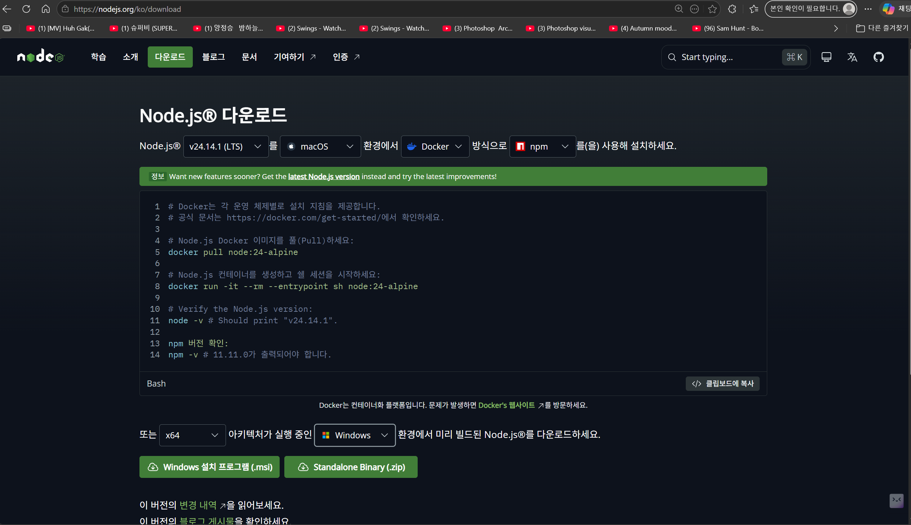
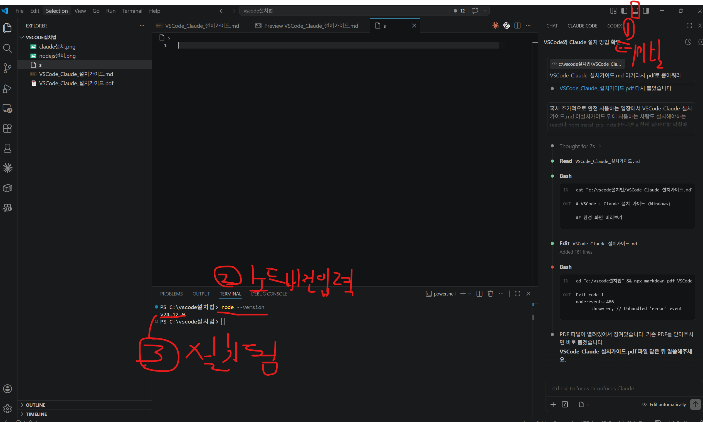
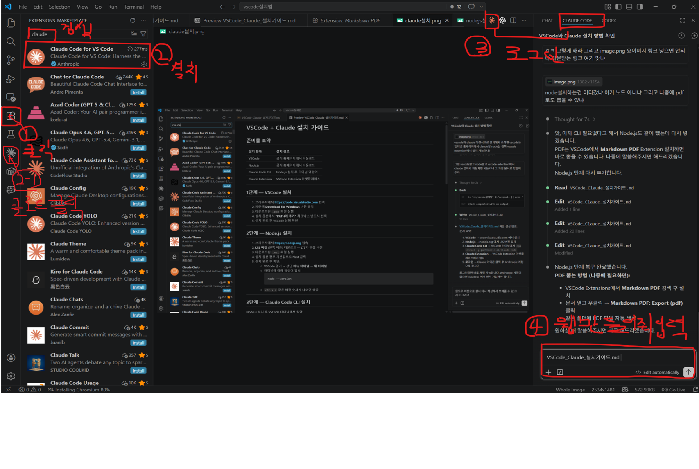
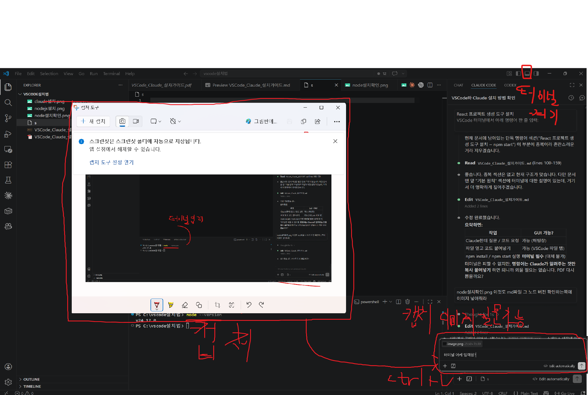
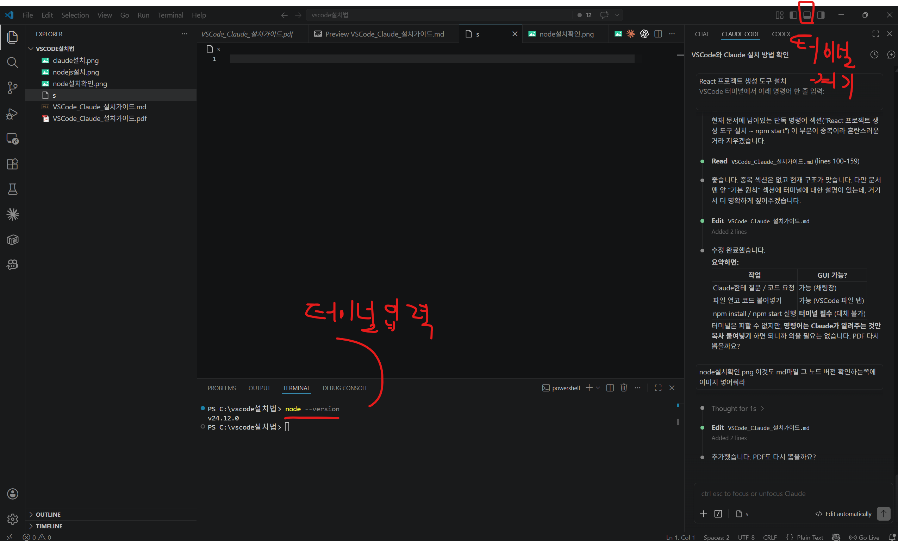

# VSCode + Claude 설치 가이드 (Windows)

## 완성 화면 미리보기

설치가 완료되면 아래처럼 VSCode 오른쪽에 Claude 채팅 패널이 열립니다.  
ChatGPT처럼 질문하고 답변 받는 형태로 코딩 도우미로 활용할 수 있습니다.

---

## 준비물 요약

| 순서 | 설치 항목 | 설치 방법 |
|---|---|---|
| 1 | VSCode | 공식 홈페이지에서 .exe 다운로드 |
| 2 | Node.js | 공식 홈페이지에서 .msi 다운로드 |
| 3 | Claude Extension | VSCode 안 Extension 마켓플레이스 |

---

## 1단계 — VSCode 설치

1. 브라우저에서 **https://code.visualstudio.com** 접속
2. **Download for Windows** 버튼 클릭 (파란색 큰 버튼)
3. 다운로드된 `VSCodeSetup-x64-x.xx.x.exe` 실행
4. 설치 중 아래 옵션 반드시 체크:
   - **"PATH에 추가 (재시작 후 사용 가능)"**
   - **"Code로 열기" 작업을 Windows 탐색기 파일 상황에 맞는 메뉴에 추가**
5. Install 클릭 후 설치 완료

---

## 2단계 — Node.js 설치



1. 브라우저에서 **https://nodejs.org/ko/download** 접속
2. **LTS 버전** 다운로드 클릭 (안정 버전)
3. 다운로드된 `node-vxx.xx.x-x64.msi` 실행
4. 모든 옵션 기본값 유지하며 Next → Next → Install
5. 설치 완료 후 **PC 재시작** 권장

### 설치 확인

VSCode 실행 → 상단 메뉴 **터미널 → 새 터미널** → 아래 입력:

```
node --version
```

`v22.x.x` 같은 숫자가 나오면 성공



---

## 3단계 — Claude Extension 설치



1. VSCode 왼쪽 사이드바 **Extensions 아이콘** 클릭
   - 네모 4개 겹친 모양 아이콘 (단축키: `Ctrl + Shift + X`)
2. 검색창에 **claude** 입력
3. **Claude for VS Code** — Anthropic 공식 선택
4. **Install** 클릭
5. 설치 완료 후 왼쪽 사이드바에 **Claude 아이콘** 생성됨

---

## 4단계 — 로그인 및 채팅 시작

1. VSCode 왼쪽 사이드바 **Claude 아이콘** 클릭
2. 오른쪽에 **Claude 채팅 패널** 열림
3. **Sign In** 버튼 클릭
4. 브라우저가 자동으로 열리면 **Anthropic 계정으로 로그인**
   - 계정이 없으면 **https://claude.ai** 에서 회원가입 먼저 진행
5. 로그인 완료 후 VSCode로 돌아오면 채팅 입력창 활성화
6. 하단 입력창에 질문 입력 → **Enter** 또는 전송 버튼

---

## 사용 방법

설치 완료 후 오른쪽 패널에서 ChatGPT처럼 바로 사용 가능합니다.

| 기능 | 방법 |
|---|---|
| 일반 채팅 | 오른쪽 입력창에 질문 입력 |
| 코드 질문 | 코드 드래그 선택 후 우클릭 → Claude에 질문 |
| 파일 전체 분석 | 파일 열고 Claude 패널에서 "@파일명" 입력 |
| 화면 캡처로 질문 | 모르는 화면 캡처 후 채팅창에 이미지 붙여넣기 |

### 화면 캡처해서 질문하기

오류 화면, 모르는 내용, 막히는 부분이 생기면 **화면을 캡처해서 그대로 Claude에 붙여넣을 수 있습니다.**  
텍스트로 설명하기 어려울 때 특히 유용합니다.

**방법:**
1. 캡처하고 싶은 화면에서 `Win + Shift + S` (화면 일부 캡처)
2. Claude 채팅 입력창 클릭 후 `Ctrl+V` 로 이미지 붙여넣기
3. "이게 뭔지 설명해줘" 또는 "이 오류 어떻게 해결해?" 입력 후 전송



---

## 자주 발생하는 문제

| 문제 | 해결 방법 |
|---|---|
| Claude 아이콘이 안 보임 | VSCode 완전 종료 후 재시작 |
| 로그인 후 채팅창이 안 열림 | Extension 비활성화 후 다시 활성화 |
| 한글 입력이 안 됨 | VSCode 재시작 또는 `Ctrl+Shift+P` → "reload window" |

---

---

# 바이브 코딩으로 웹사이트 만들기 (완전 초보자용)

> **바이브 코딩(Vibe Coding)** 이란?  
> 코드를 직접 짜지 않고, AI에게 말로 설명해서 코드를 만들어내는 방식입니다.  
> 모르는 게 생기면 전부 Claude한테 물어보면 됩니다. 명령어 외울 필요 없습니다.

---

## 기본 원칙 — 모르면 Claude한테 물어보면 됩니다

`npm install`, `npm start` 같은 명령어는 터미널에서 실행해야 합니다. 이건 GUI로 대체가 안 됩니다.  
**단, 명령어를 외우거나 스스로 찾을 필요가 없습니다.**  
Claude한테 상황을 설명하면 Claude가 "터미널에 이걸 복사해서 붙여넣어" 하고 정확히 알려줍니다.

> **터미널 여는 방법**: VSCode 상단 메뉴 → **터미널 → 새 터미널**  
> 검은 입력창이 열리면 Claude가 알려준 명령어를 `Ctrl+V` 로 붙여넣고 `Enter` 만 누르면 됩니다.  
> 명령어가 뭔지 몰라도 됩니다. Claude가 알려주는 걸 그대로 붙여넣기만 하면 됩니다.

**터미널 입력 방법**



---

## STEP 1 — 프로젝트 시작 프롬프트 (이것만 복사해서 붙여넣기)

VSCode 오른쪽 Claude 패널에 아래 내용을 복사해서 붙여넣고 **[만들고 싶은 것]** 부분만 바꿔주세요.

```
나는 코딩을 전혀 모르는 완전 초보자야.
지금 VSCode를 열었고 오른쪽에 Claude 채팅이 있어.
터미널도 어떻게 쓰는지 잘 몰라.

React로 [만들고 싶은 것] 웹사이트를 처음부터 만들어줘.
단계마다 터미널에 붙여넣을 명령어랑 작업이 끝나면 다음에 뭘 해야 하는지 알려줘.
모르는 용어는 쉽게 설명해줘.
```

> **[만들고 싶은 것]** 자리에 원하는 걸 구체적으로 적을수록 결과가 좋습니다.  
> 예) 포트폴리오, 쇼핑몰, 날씨 앱, 할 일 메모장, 음식 주문 사이트 등

**예시 (포트폴리오 웹사이트):**

```
나는 코딩을 전혀 모르는 완전 초보자야.
지금 VSCode를 열었고 오른쪽에 Claude 채팅이 있어.
터미널도 어떻게 쓰는지 잘 몰라.

React로 나를 소개하는 포트폴리오 웹사이트를 처음부터 만들어줘.
이름, 사진, 소개글, 연락처 섹션이 들어가고 깔끔한 디자인으로 해줘.
단계마다 터미널에 붙여넣을 명령어랑 작업이 끝나면 다음에 뭘 해야 하는지 알려줘.
모르는 용어는 쉽게 설명해줘.
```

---

## STEP 2 — Claude가 알려주는 대로만 따라하기

Claude가 답변을 주면 이렇게 따라하면 됩니다.

**터미널 명령어가 나오면:**
1. VSCode 상단 메뉴 → **터미널 → 새 터미널** 클릭
2. Claude가 준 명령어 복사 → 터미널 클릭 → `Ctrl+V` → `Enter`
3. 완료되면 Claude한테 "완료했어, 다음은?" 이라고 입력

**코드가 나오면:**
1. Claude가 "이 파일을 열어라" 하는 파일을 VSCode에서 열기
2. 기존 내용 전체 선택 (`Ctrl+A`) → 삭제 → Claude 코드 붙여넣기
3. 저장 (`Ctrl+S`)
4. 브라우저에서 확인

---

## STEP 3 — 상황별 프롬프트 모음

### 다음 단계를 모를 때

```
방금 [한 것] 했어. 다음에 뭘 해야 해?
터미널 명령어가 있으면 복사할 수 있게 알려줘.
```

---

### 오류가 났을 때

터미널이나 브라우저에 빨간 글씨가 나오면 전체 드래그 → `Ctrl+C` → Claude 채팅창에 붙여넣기

```
아래 오류가 났어. 왜 이런 건지 쉽게 설명해주고
수정 방법이랑 수정된 전체 코드 보여줘.

[오류 메시지 붙여넣기]
```

---

### 기능을 추가하고 싶을 때

```
지금 웹사이트에 [추가하고 싶은 기능]을 추가하고 싶어.
설치해야 할 게 있으면 터미널 명령어도 같이 알려주고
수정할 파일이랑 전체 코드 보여줘.
```

예시:
```
지금 웹사이트에 버튼을 누르면 다크모드로 바뀌는 기능을 추가하고 싶어.
설치해야 할 게 있으면 터미널 명령어도 같이 알려주고
수정할 파일이랑 전체 코드 보여줘.
```

---

### 디자인을 바꾸고 싶을 때

```
지금 웹사이트 디자인을 바꾸고 싶어.
분위기: [예) 깔끔한 / 화려한 / 카페 느낌 / 애플 홈페이지 느낌]
색상: [원하는 색] 계열
수정할 파일이랑 전체 코드 보여줘.
```

---

### 용어나 개념이 이해가 안 될 때

```
[모르는 단어나 상황]이 뭔지 코딩 모르는 사람도 이해할 수 있게 설명해줘.
```

---

### 완전히 막혔을 때 (만능 프롬프트)

```
나는 코딩 초보야. 지금 [상황 설명]인데 어떻게 해야 할지 모르겠어.
뭘 해야 하는지 순서대로 알려줘. 터미널 명령어가 있으면 복사할 수 있게 알려줘.
모르는 용어는 쉽게 설명해줘.
```

---

## 바이브 코딩 전체 흐름

```
① Claude한테 "이런 웹사이트 만들어줘" 요청
         ↓
② Claude가 터미널 명령어 + 코드 알려줌
         ↓
③ 터미널에 명령어 복사 붙여넣기 → Enter
         ↓
④ 파일 열고 코드 전체 교체 → Ctrl+S 저장
         ↓
⑤ 브라우저에서 확인
         ↓
⑥ 마음에 안 들면 "이 부분 바꿔줘" 요청
         ↓
⑦ 반복
```

> 막히면 무조건 Claude 채팅창에 상황 설명하면 됩니다.  
> "뭘 물어봐야 할지 모르겠어" 라고 해도 됩니다. Claude가 먼저 물어봐줍니다.

---

## 꼭 기억할 것 3가지

| 번호 | 규칙 |
|---|---|
| 1 | 코드 바꾼 뒤 반드시 **Ctrl+S** 로 저장 |
| 2 | 오류나면 빨간 글씨 전체를 Claude에 붙여넣기 |
| 3 | 한 번에 한 가지씩만 요청하기 (한꺼번에 많이 바꾸면 오류 추적이 어려움) |
